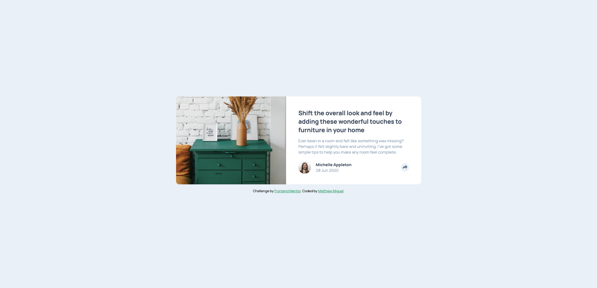
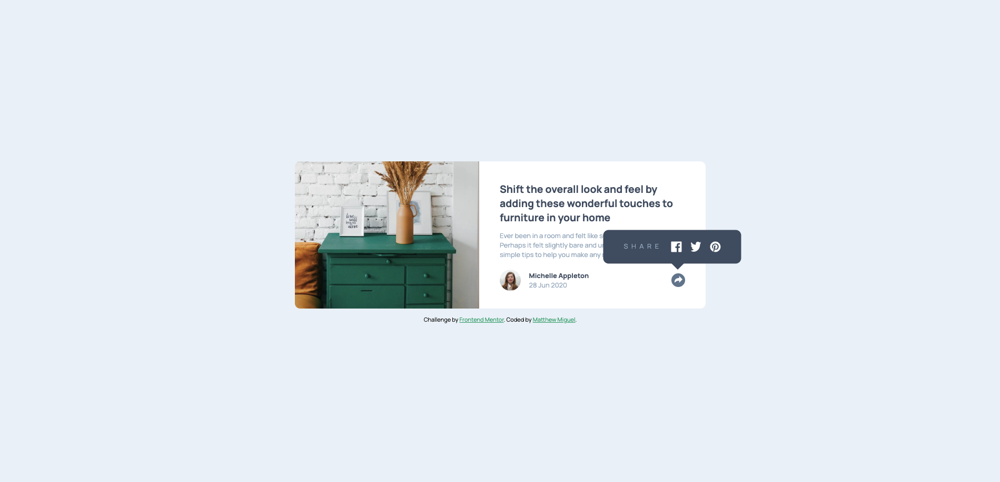

# Frontend Mentor - Article preview component solution

This is a solution to the [Article preview component challenge on Frontend Mentor](https://www.frontendmentor.io/challenges/article-preview-component-dYBN_pYFT). Frontend Mentor challenges help you improve your coding skills by building realistic projects. 

## Table of contents

- [Overview](#overview)
  - [The challenge](#the-challenge)
  - [Screenshot](#screenshot)
  - [Links](#links)
- [My process](#my-process)
  - [Built with](#built-with)
  - [What I learned](#what-i-learned)
  - [Continued development](#continued-development)
- [Author](#author)

## Overview

### The challenge

Users should be able to:

- View the optimal layout for the component depending on their device's screen size
- See the social media share links when they click the share icon

### Screenshot

### Links

- Solution URL: [click me!](https://github.com/MattJM1007/Article-Preview-Card)
- Live Site URL: [click me too!](https://mattjm1007.github.io/Article-Preview-Card/)

## My process

### Built with

- Semantic HTML5 markup
- CSS 
- Flexbox
- Javascript

### What I learned

It has been a while since I have done frontend mentor project. I feel like I coded this quicker than I would have in the past. I learned to make a triangle with css to put under the social section. I also made good use of flexbox to position all the elements. I also learned how to change the icon in the button to white using CSS.

### Continued development

I would like try using the anchor property in CSS to position the social section. I think it would be a good challenge and upgrade!

## Author

- Frontend Mentor - [@MattJM1007](https://www.frontendmentor.io/profile/MattJM1007)
